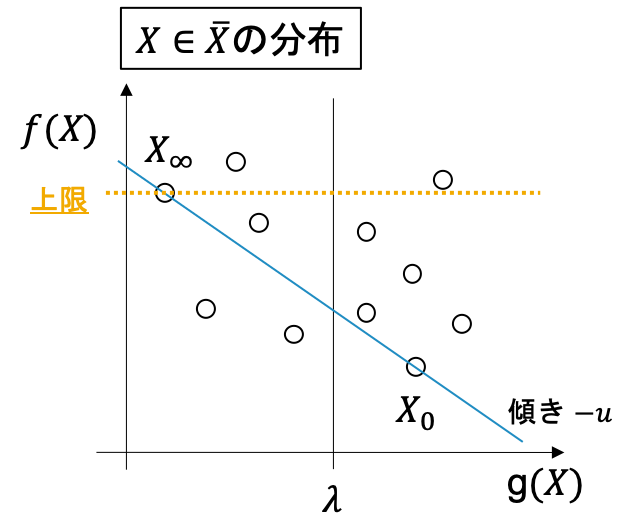
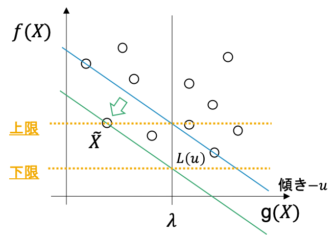
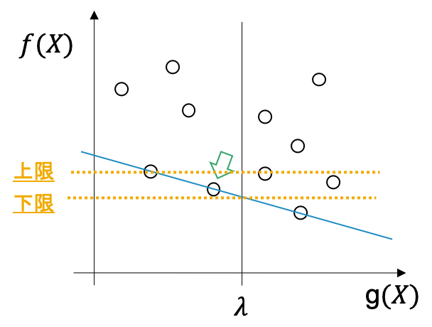
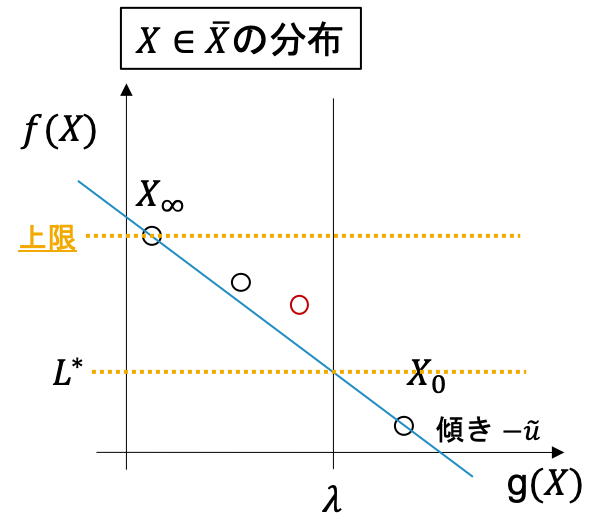
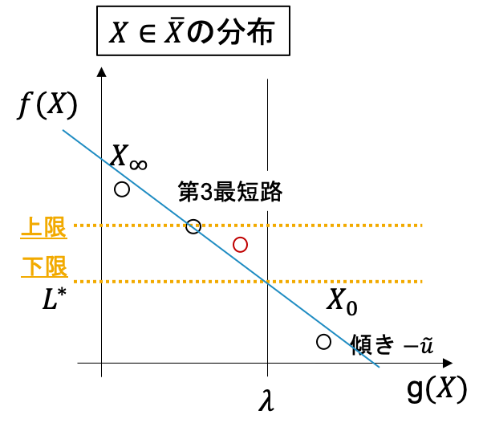
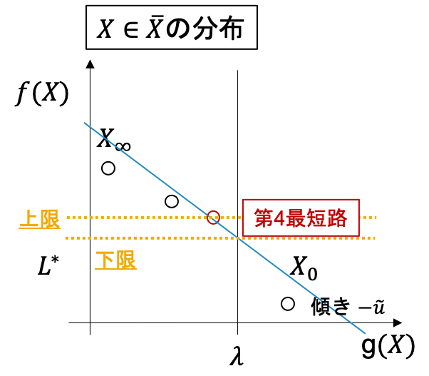
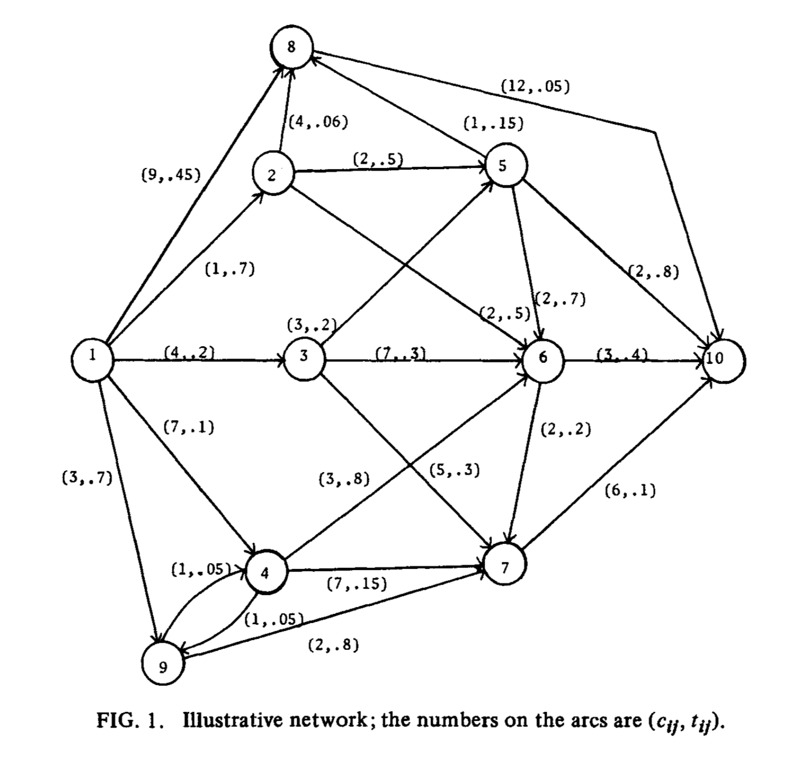

# Hander-Zang Algorithm

## 制約付き最短路とは

グラフ$G=(V, A)$が与えられているとします.
$V$: 点集合, $A \subset V \times V$: 枝集合

$(i ,j) \in A$ で始点が$i$, 終点が$j$である枝を表します.
各枝$(i, j)$には二種類の重みがあり, それを$c_{ij}$, ${t_{ij}} \in \mathbb{R}$とします.

**制約付き最短路問題**とは, 始点$s$, 終点$e$があって, $s$と$e$を結ぶパスの中で

1. 枝の$t_{ij}$の総和が$\lambda$以下で
2. 枝の$c_{ij}$の総和が最小のもの

を見つける問題です. 特に1. の形の制約はナップサック型制約と呼ばれるため, 
上の形の問題は**ナップサック型制約付き最短路問題**と呼ばれます.


始点$s​$と終点$e​$を結ぶパスの集合を$\bar{X} \subset 2^{A}​$($A​$の冪集合)とすると, 下記のように問題を記述できます.
$$
\begin{align*}
\min_{X \in \bar{X}} &\sum_{(i, j) \in X}c_{ij}\\
{\rm s.t.} &\sum_{(i, j) \in X}t_{ij} \leq \lambda
\end{align*}
$$
さらに簡略化のために
$$
f(X) := \sum_{(i, j) \in X}c_{ij}\\
g(X) := \sum_{(i, j) \in X}t_{ij}
$$
とおいて, 上記の問題を
$$
\begin{align*}
\min_{X \in \bar{X}} & f(X)\\
{\rm s.t.} ~~& g(X)\leq \lambda
\end{align*}
$$
と書くことにします. この問題を今後**CSP**と呼びます.


下記ではCSPの最適値を
$$
\displaystyle f^* \left(=f(X^*) = \min_{X \in \bar{X}; g(X) \leq \lambda}f(X)\right)
$$
と書きます.


## Hander-Zang Algorithm([1])の流れ

1. CSPの下限値を与えるような**DCSP**を定義する
2. DCSPを解きながら, CSPの良い下限値と同時に実行可能解を求める
3. 最適解の保証が行われるまで第k最短路問題をとく


### DCSP

$u \in \mathbb{R}$に対して, 以下を定義します.
$$
\displaystyle L(u, X) := f(X) + u(g(X) - \lambda)\\
L(u) := \min_{X \in \bar{X}}L(u, X)
$$
$L(u)$はCSPに対するラグランジュ緩和での目的関数です.
ここで, よく知られている**弱双対性**から
$$
L(u) \leq f^* (=CSPの最適値) ~~ (\forall u \geq 0)
$$
が成立します.

> (証明) $X^*​$をCSPの最適解とすると, $X^*​$はCSPの実行可能解なので
> $X^* \in \bar{X}, g(X^*) \leq \lambda​$を満たしている. $u \geq 0​$に留意すると,
> $\displaystyle L(u) = \min_{X \in \bar{X}} L(u, X) \leq L(u, X^*) = f(X^*) + u\left(g(X^*)-\lambda\right) \leq f(X^*) = f^*​$ (終)

$\forall u \geq 0​$について, $L(u)​$はCSPの最適値の下限を与えるので, その中で最大のものに興味があります. そこで**DCSP**を次のような問題として定義します.
$$
L^* = L(u^*) = \max_{u \geq 0}L(u)
$$

>  もし, CSPに凸性があれば, **強双対性**である$L^* = f^*​$が成立しますが,
> 今回の場合は一般には成立しません.


$L(u)$を計算するのは簡単で, $(i, j)$の枝の重みを$c_{ij} + u t_{ij}$としたグラフ上での$s-e$最短路長が$L(u)$になることは, すぐに確認できます.


### CSPの上限と下限の更新

DCSP $\displaystyle \max_{u \geq 0}L(u)$の最適解を求めるのは容易ではありません. なので, 次のような手続きでDCSPの近似解(=CSPの下限)を見つけるのと同時に, CSPの上限も更新していきます.

簡単に例を見ていきます.


1. まず, $L(0)$と$L(+\infty)$を求めて, その最適解をそれぞれ$X_0, X_{\infty}$とします(下図).



ここで, もし$X_0$が$g(X_0) \leq \lambda$ を満たしているならば, $X_0$を最適解として出力して終了します. もし$g(X_\infty) > \lambda$であれば, 実行可能解なし(制約を満たすパスが存在しない)となり, 終了します. そうでないならば$f(X_\infty)$がCSPの最適値の上限になることは図より明らかですね. さらに$X_0$と$X_\infty$を結ぶ直線の傾きに$-1$をかけたものを$u$とします.

2. $L(u)$を解きます. これは上図でいうと, $g(X) = \lambda$上での切片が最小となるような, 傾き$-u$の直線を通る$\tilde{X} \in \bar{X}$を求めることに相当し, $L(u)$にはそのときの切片の値が入ります (下図).

   

上の議論より, このときの$L(u)$がCSPの下限としてとれます.
また, もし$g(\tilde{X}) \leq \lambda$であれば, 上限値も$f(\tilde{X})$で更新できます.


3. 実行可能領域$R = \{X; X \in \bar{X}, g(X) \leq \lambda\}$, 非実行可能領域$C=\{X; X\in \bar{X} g(X) > \lambda\}$について, 上記の手続きで$R$上で$f(X)$が最小の点を$p_{r_{min}}$, $C$上で最小の点を$p_{c_{min}}$とします. (図の場合, $p_{r_{min}} = \tilde{X}, p_{c_{min}} = X_0$)
   $p_{r_{min}}$と$p_{c_{min}}$を結ぶ直線の傾きに$-1$をかけたものを$u$として, $L(u)$を解き, $p_{r_{min}}$, $p_{c_{min}}$のどちらかをそのとき得られた解に更新します.
   さらに, それによって可能であれば上限と下限と更新します.



これを$u$が更新されなくなるまで繰り返します.
もし, そのとき上限 = 下限であれば, $p_{r_{min}}$が最適解として出力されます.


###第k最短路による最適性の保証

そうではない場合(例えば下図; 赤丸が最適解)は, 最適解をさらに第$k$最短路により求めます.



前のステップの最後の$u$を$\tilde{u}$として,$L(\tilde{u})$の第3最適解以降を求めていきます(下図). 前述しているように$L(u)$自体はグラフの枝の重みを変更したグラフの最短路問題に帰着できるため, これはグラフ上での第$k$最短路を求めることに相当します.



見つかった解に従って, 上限下限と$p_{r_{min}}$を更新していきます.



第$k$最短路がなくなったり, 上限と下限のギャップがなくなれば(もしくは逆転する) そのときの$p_{r_{min}}$を最適解として出力します.


## Pythonでの実装

このHander-Zangアルゴリズムをpythonで実装しました.

[dual_algorithm.py](https://gist.github.com/91e93a6fb43a713a4fa9105542d6e936)

最短路計算にはBellman-Ford法(計算量$O(|V||A|))​$
第1-K最短路を求めるのはEppstein法([3])$O(|A|+|V|\log|V|+K)​$を用いています.
(Yen法([2])も実装しましたが, Eppstein法の方が圧倒的に速いです)


## 例



論文([1])中の例です([グラフデータ](https://gist.github.com/nariaki3551/edcfd4af39364c624e614f59a13b715f)). このとき1から10へのパスでコスト$t$の総和が1以下のパスで最小のものを求めると, 次のようになります.

```bash
python dual_algorithm.py fig1_graph.csv 1 10 1
Build Date: Mar 07 2019
Main Algorithm            : Hander-Zang algorithm
Shortest Path Algorithm   : Bellman-Ford algorithm
K Shortest Path Algorithm : Eppstein algorithm

the number of nodes: 10
the number of edges: 22
We obtain shortest path on weight (#STEP1)
    f = 5.000, g = 1.000

We obtain shortest path on cost (#STEP2)
    f = 20.000, g = 0.350

Best Solution:  20.000

------------------------------------------------------------
 Iter Step Update    Best      LB      UB     Gap    Time
------------------------------------------------------------
    1   #1     LB       -    5.00       -      -%      0s
    2   #2     UB   20.00    5.00   20.00  78.95%      0s
    3   #3          20.00    5.00   20.00  78.95%      0s
    4   #3     UB   15.00    5.00   15.00  71.43%      0s
    5   #3     LB   15.00   11.00   15.00  28.57%      0s
    6   #4     LB   15.00   12.00   15.00  21.43%      0s
    7   #4  LB UB   14.00   13.00   14.00   7.69%      0s
    8   #4     LB   14.00   13.50   14.00   3.85%      0s
    9   #4     LB   14.00   15.00   14.00  -7.69%      0s


*Optimal Solution: 14.00
    path [('1', '3', 0), ('3', '6', 0), ('6', '10', 0)]
    f = 14.000, g = 0.900
```


step#1#2が$L(0), L(+\infty)$を求めることで, step#3がCSPの上限と下限の更新, step#4が第k最短路に対応しています.


## 参照

[1] Handler, Gabriel Y., and Israel Zang. "A dual algorithm for the constrained shortest path problem." *Networks* 10.4 (1980): 293-309.

[2] Yen, Jin Y. "Finding the k shortest loopless paths in a network." management Science 17.11 (1971): 712-716.

[3] Eppstein, David. "Finding the k shortest paths." *SIAM Journal on computing* 28.2 (1998): 652-673.


